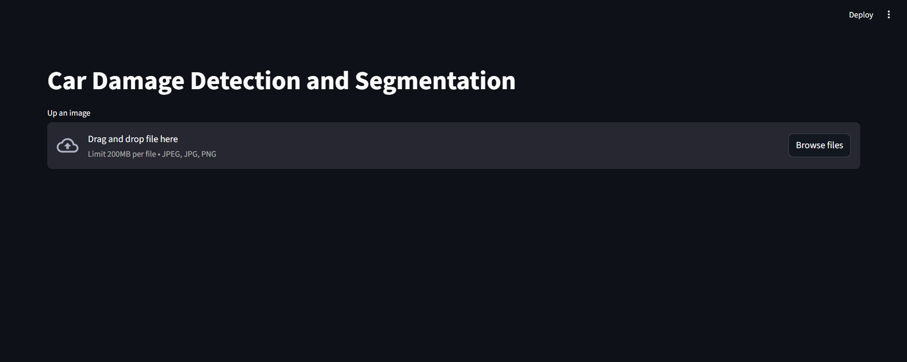

# Car Damage Assessment

## Author
- Name: Nguyen Tuan Ngoc
- University: Danang University of Science and Technology (DUT)
- Student ID: 102230087

## Project Overview
This project provides an end-to-end solution for Sun* Insurance Company for car damage assessment using deep learning. It includes:
- Damage classification (ResNet18)
- Object detection and segmentation (YOLOv8)
- Severity estimation 
- Web demo (Streamlit)

## TechStack

### Backend

| Technology         | Version  | Reason for Choice                                                        |
|--------------------|----------|--------------------------------------------------------------------------|
| Python             | 3.9+     | Powerful for AI/ML, large community, rich ecosystem                      |
| FastAPI            | Latest   | Modern, high-performance web framework, easy to build REST APIs           |
| PyTorch            | Latest   | Leading deep learning framework, research and production ready            |
| Ultralytics YOLO   | Latest   | State-of-the-art object detection/segmentation, easy integration          |
| OpenCV             | 4.8+     | Powerful image processing, many utilities for preprocessing               |
| Pandas             | Latest   | Efficient data manipulation and analysis                                  |
| scikit-learn       | Latest   | Traditional ML library, supports evaluation and preprocessing             |
| Uvicorn            | Latest   | Lightweight ASGI server, optimized for FastAPI                            |
| MySQL Connector    | Latest   | Database connectivity and operations with MySQL                           |

### Frontend

| Technology   | Version  | Reason for Choice                                         |
|--------------|----------|----------------------------------------------------------|
| Streamlit    | Latest   | Rapid web app development for AI/ML, intuitive and easy   |
| Matplotlib   | Latest   | Data visualization and plotting                           |
| Seaborn      | Latest   | Advanced, beautiful data visualization                    |
| Pillow       | Latest   | Basic image processing, supports many formats             |

## Project Structure
```
car_damage_assessment/
├── app/                          # Backend application modules
│   ├── __init__.py
│   ├── main.py                   # FastAPI main application
│   ├── database.py               # Database connection and operations
│   ├── model_loader.py           # Model loading utilities
│   ├── predict_image.py          # Image prediction functions
│   ├── predict_query.py          # Query prediction handlers
│   ├── detect_query.py           # Object detection query handlers
│   ├── detect_utils.py           # Object detection utilities
│   ├── segment_query.py          # Segmentation query handlers
│   ├── segment_utils.py          # Segmentation utilities
│   └── severity_level.py         # Damage severity estimation
│
├── car_damage_yolo/              # YOLO dataset for damage detection
│   ├── data.yaml                 # Dataset configuration
│   ├── train/                    # Training images and labels
│   ├── valid/                    # Validation images and labels
│   └── test/                     # Test images and labels
│
├── car_segmentation/             # YOLO dataset for car part segmentation
│   ├── data.yaml                 # Dataset configuration
│   ├── train/                    # Training images and labels
│   ├── valid/                    # Validation images and labels
│   └── test/                     # Test images and labels
│
├── data_split/                   # Preprocessed dataset splits
│   ├── clean_images/             # Clean images for detection/segmentation
│   ├── train/                    # Training data by damage type
│   │   ├── bumper_dent/
│   │   ├── bumper_scratch/
│   │   ├── door_dent/
│   │   ├── door_scratch/
│   │   ├── glass_shatter/
│   │   ├── head_lamp/
│   │   └── tail_lamp/
│   ├── val/                      # Validation data by damage type
│   ├── test/                     # Test data by damage type
│   └── test_unknown/             # Unknown damage type images
│
├── models/                       # Model weights (download required)
│   ├── car_resnet18_model_best.pth  # Classification model
│   ├── yolov8s.pt                   # Detection model
│   └── yolov8n-seg.pt               # Segmentation model
│
├── notebooks/                    # Jupyter notebooks
│   ├── explore_data.ipynb        # Data exploration and analysis
│   ├── evaluate.ipynb            # Model evaluation
│   └── evaluate_unknown.ipynb    # Unknown data evaluation
│
├── scripts/                      # Utility scripts
│   ├── dataset_loader.py         # Dataset loading utilities
│   ├── evaluate.py               # Model evaluation script
│   └── evaluate_unknown.py       # Unknown data evaluation script
│
├── static/                       # Static files and outputs
│   ├── output/                   # Generated output images
│   └── segment_masks/            # Segmentation mask outputs
│
├── screenshots/                  # Demo screenshots
│   ├── streamlit_ui.png          # Streamlit interface screenshot
│   ├── object_detect.png         # Object detection demo
│   └── segment_estimat.png       # Segmentation demo
│
├── runs/                         # Training outputs
│   ├── detect/                   # Detection model training results
│   └── segment/                  # Segmentation model training results
│
├── image/                        # Original dataset images
├── temp/                         # Temporary files
├── temp_seg_images/              # Temporary segmentation images
│
├── streamlit_app.py              # Streamlit web application
├── requirements.txt              # Python dependencies
├── Dockerfile                    # Docker configuration
├── .dockerignore                 # Docker ignore file
├── split_data.py                 # Data splitting utility
├── split_unknown.py              # Unknown data splitting utility
├── clean_images.py               # Image cleaning utility
├── sql_table.sql                 # Database schema
├── yolov8n-seg.pt                # Pre-trained segmentation model
├── yolov8s.pt                    # Pre-trained detection model
│
├── README.md                     # Project documentation
├── TRAINING.md                   # Training documentation
├── PIPELINE_ANALYSIS.md          # Pipeline analysis documentation
└── LICENSE                       # Project license
```

## Model Weights
Model weights are not included in the repository. Download them from Google Drive:
- [car_resnet18_model_best.pth](https://drive.google.com/drive/u/0/folders/1BZrsCd0w1LLyp7skGPFr9yNJtmrVdNJ5)
- [yolov8n-seg.pt](https://drive.google.com/drive/u/0/folders/1BZrsCd0w1LLyp7skGPFr9yNJtmrVdNJ5)
- [yolov8s.pt](https://drive.google.com/drive/u/0/folders/1BZrsCd0w1LLyp7skGPFr9yNJtmrVdNJ5)

## Quick Start

### Option 1: Local Installation
1. Install dependencies:
   ```bash
   pip install -r requirements.txt
   ```
2. Download model weights from Google Drive and place them in the `models/` folder.
3. Run the Streamlit app:
   ```bash
   streamlit run streamlit_app.py
   ```
4. Or run training/evaluation scripts in `scripts/`.

### Option 2: Docker (Recommended)
1. Build the Docker image:
   ```bash
   docker build -t car-damage-assessment .
   ```
2. Download model weights from Google Drive and place them in the `models/` folder.
3. Run the container:
   ```bash
   docker run -p 8501:8501 -v $(pwd)/models:/app/models car-damage-assessment
   ```
4. Open your browser and navigate to `http://localhost:8501`

## Demo
Below are some demo screenshots of the application in action:

### 1. Streamlit Web UI


### 2. Object Detection Result


### 3. Segmentation & Severity Estimation


## License
This project is for educational purposes only.
